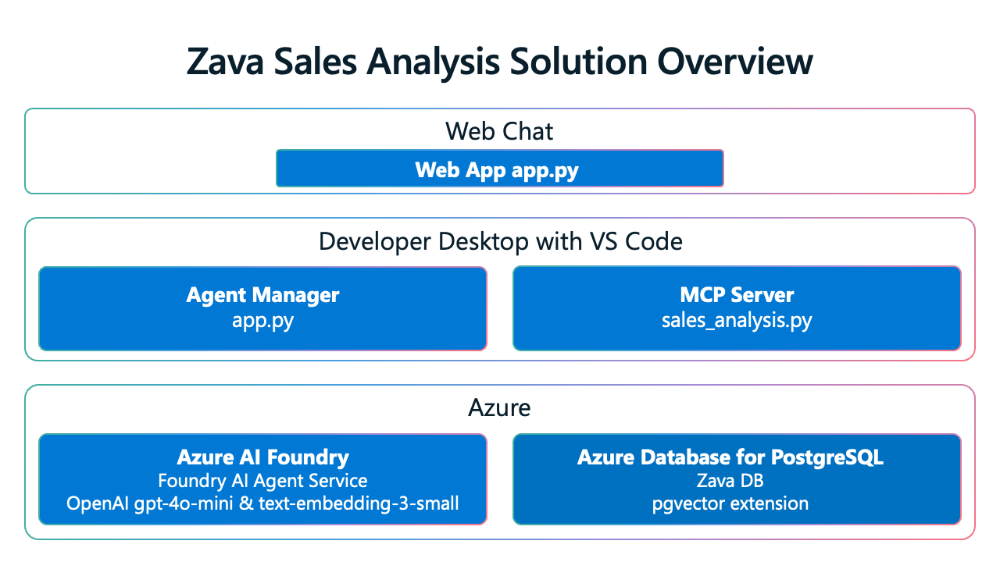

## Core technologies at a glance

- **Azure AI Foundry Agent Service**
  Hosts the LLM-driven agent; orchestrates tools (including MCP Servers); manages context, Code Interpreter, and token streaming; and provides authentication, logging, and scaling.
- **MCP Servers**
  MCP (Model Context Protocol) is an open standard that gives LLMs a unified interface to external tools, APIs, and data. It standardizes tool discovery (like OpenAPI for REST) and improves composability by making tools easy to update or swap as needs evolve.
- **PostgreSQL + pgvector**
  Stores relational data and embeddings; supports both relational (SQL) and semantic (vector) queries (via pgvector), governed by SQL and RLS.

**Together:** the Agent Service routes user intents; the MCP server translates them into tool/SQL calls; PostgreSQL+pgvector answers semantic and analytical questions.

## Architecture



## Key benefits of MCP Servers

- **Interoperability** – Connect AI agents to any vendor’s MCP‑enabled tools with minimal custom code.
- **Security hooks** – Integrate sign‑in, permissions, and activity logging.
- **Reusability** – Build once, reuse across projects, clouds, and runtimes.
- **Operational simplicity** – A single contract reduces boilerplate and maintenance.

## Best practices demonstrated

- **Asynchronous APIs:** Agents service and PostgreSQL use async APIs; ideal with FastAPI/ASP.NET/Streamlit.
- **Token streaming:** Improves perceived latency in the UI.
- **Observability:** Built‑in tracing and metrics support monitoring and optimization.
- **Database security:** PostgreSQL is secured with restricted agent privileges and Row‑Level Security (RLS), limiting agents to only their authorized data.
- **Code Interpreter:** The [Azure AI Agents Service Code Interpreter](https://learn.microsoft.com/azure/ai-services/agents/how-to/tools/code-interpreter?view=azure-python-preview&tabs=python&pivots=overview){:target="_blank"} runs LLM‑generated code on demand in a **sandboxed** environment, preventing actions beyond the agent’s scope.

### Extensibility

The workshop pattern can be adapted (e.g., customer support) by updating the database + agent instructions in Foundry.

## DevTunnel Architecture

In the workshop environment, the Agent Service runs in Azure but needs to connect to your locally-running MCP Server. DevTunnel creates a secure tunnel that exposes your local MCP Server to the cloud-based Agent Service.

```plaintext
          Azure Cloud                           Local Development
    ┌─────────────────────┐                  ┌─────────────────────┐
    │   Zava Agent App    │                  │                     │
    │   (Azure-hosted)    │                  │  ┌─────────────────┐│
    │                     │                  │  │   MCP Server    ││
    │ ┌─────────────────┐ │                  │  │ (sales_analysis)││
    │ │ Azure AI        │ │                  │  │ localhost:8000  ││
    │ │ Agents Service  │ │                  │  └─────────────────┘│
    │ └─────────────────┘ │                  │           │         │
    └─────────────────────┘                  │           ▼         │
              │                              │  ┌─────────────────┐│
              │ HTTPS requests               │  │   PostgreSQL    ││
              ▼                              │  │   + pgvector    ││
    ┌─────────────────────┐                  │  └─────────────────┘│
    │   DevTunnel         │                  │                     │
    │   Public Endpoint   │◄─────────────────┼──── Secure Tunnel   │
    │ (*.devtunnels.ms)   │    Port Forward  │                     │
    └─────────────────────┘                  └─────────────────────┘
```

**How DevTunnel Works in the Workshop:**

1. **Local Development**: You run the MCP Server locally on `localhost:8000`
2. **DevTunnel Creation**: DevTunnel creates a public HTTPS endpoint (e.g., `https://abc123.devtunnels.ms`) connected to `localhost:8000`.
3. **Azure Integration**: The Azure-hosted Agent Service connects to the MCP Server through the DevTunnel endpoint.
4. **Transparent Operation**: The agent service operates normally, unaware it's accessing the MCP Server running locally through a tunnel.

This setup allows you to:

- Develop and debug locally while using cloud-hosted AI services
- Test realistic scenarios without deploying the MCP Server to Azure
